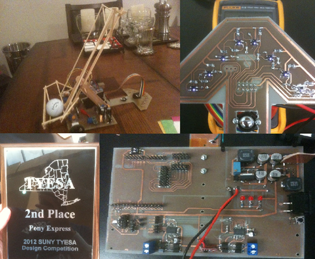

# Line Follower Robot - BMCC Robotics Team "Shika-Bob"

**2012 SUNY TYESA Student Design Competition - 2nd Place Finish**




An Arduino-based autonomous line following robot that competed in the 2012 SUNY TYESA Student Design Competition. This project represents an early milestone in embedded systems development, featuring custom PCB design, PID control implementation, and real-time wireless tuning capabilities.

## 🏆 Competition Results

- **2nd Place** - 2012 SUNY TYESA Student Design Competition
- **Team**: "Shika-Bob" from BMCC Robotics
- **Achievement**: Successfully recovered from major hardware failure 3 weeks before competition

## 🎯 Project Overview

This line follower robot was designed as a multidisciplinary engineering project focusing on autonomous navigation, real-time control systems, and custom hardware development. The robot demonstrates advanced features typically found in much more complex systems, including wireless parameter tuning and sophisticated sensor integration.

### Key Features

- **PID Control Algorithm**: Smooth and responsive line following with real-time parameter adjustment
- **Custom PCB Design**: Hand-etched contrast sensor bar replacing commercial alternatives
- **Wireless Tuning**: Live PID parameter adjustment via XBee 2.4GHz RF modules
- **Dual Design Iterations**: Evolution from Arduino prototype to 32-bit ARM Cortex-M3 implementation
- **High-Resolution Sensing**: Custom sensor array for maximum line detection accuracy
- **Autonomous Ball Passing**: Mechanical system for object manipulation during competition

## 🔧 Technical Specifications

### Hardware Platforms

#### Prototype Design (Competition Version)
- **Microcontroller**: Arduino-based design
- **Motors**: Regulated 8V supply from 11.1V LiPo battery
- **Sensors**: Custom 7-segment contrast sensor bar (hand-etched PCB)
- **Communication**: XBee 2.4GHz wireless modules
- **Mechanical**: Wooden craft stick ball passing mechanism with servo actuation

#### Advanced Design ("Shishka" and "Bob")
- **Microcontroller**: 32-bit 3.3V ARM Cortex-M3 (Leaflabs Maple Board)
- **Motors**: High RPM, low torque Pololu motors with regulated 8V supply
- **Advanced Features**: Enhanced PID implementation and improved sensor integration

### Software Architecture

- **Control Algorithm**: PID (Proportional-Integral-Derivative) control
- **Communication Protocol**: Bidirectional serial data exchange
- **Real-time Tuning**: Live parameter adjustment during track runs
- **Performance Monitoring**: Lap time tracking and telemetry logging

## 🚀 Technical Achievements

### Custom Electronics Design
- **Eagle CAD**: Complete schematic capture and PCB layout
- **DIY PCB Fabrication**: Hand-etched circuit boards using chemical etching
- **SMT Components**: Migration from through-hole to surface-mount design
- **Multi-layer PCB**: Ground plane implementation and via routing

### Software Engineering
- **PID Implementation**: From-scratch proportional-integral-derivative controller
- **Real-time Performance**: Optimized sensor reading and motor control loops
- **Wireless Communication**: Bidirectional parameter adjustment system
- **Data Logging**: Performance metrics and debugging telemetry

### System Integration
- **Multi-voltage Rails**: 3.3V, 5V, and 8V power management
- **Sensor Fusion**: High-resolution contrast detection array
- **Motor Control**: PWM-based speed regulation with feedback
- **Mechanical Design**: Lightweight chassis optimized for speed and agility

## 📊 Competition Performance

The robot demonstrated exceptional performance characteristics:
- **Consistent Line Following**: Stable tracking with minimal oscillation
- **Fast Recovery**: Quick correction from line deviations
- **Reliable Communication**: Robust wireless link for real-time tuning
- **Competitive Speed**: Optimized for both accuracy and velocity

## 🛠️ Build Process & Development Timeline

### Phase 1: Research & Planning (Sept 2011 - Feb 2012)
- Component selection and procurement
- Initial Arduino prototyping
- Team formation and project planning

### Phase 2: Prototype Development (Feb 2012 - Apr 2012)
- Custom PCB design in Eagle CAD
- PID algorithm implementation
- Wireless communication system setup

### Phase 3: Advanced Design (Mar 2012 - Apr 2012)
- ARM Cortex-M3 migration
- Enhanced sensor integration
- Performance optimization

### Phase 4: Competition Preparation (Apr 2012)
- System integration and testing
- Emergency prototype restoration after hardware failure
- Final competition runs and 2nd place finish

## 🎓 Educational Objectives & Outcomes

This project served multiple educational goals:

### Technical Skills Developed
- **PCB Design**: Eagle CAD schematic capture and layout
- **Embedded Programming**: Low-level sensor interfacing and motor control
- **Control Systems**: PID algorithm theory and implementation
- **RF Communication**: Wireless data transmission and protocol design
- **Hardware Debug**: Oscilloscope analysis and system troubleshooting

### Project Management Experience
- **Team Leadership**: Managing multidisciplinary engineering team
- **Crisis Management**: Recovering from major hardware failure
- **Documentation**: Technical writing and presentation skills
- **Time Management**: Meeting competition deadlines under pressure

## 🔍 Technical Deep Dive

### PID Control Implementation

The robot implements a sophisticated PID control algorithm:

```cpp
// Simplified PID structure
float error = calculateLinePosition() - centerPosition;
float proportional = Kp * error;
float integral = Ki * integralSum;
float derivative = Kd * (error - lastError);
float correction = proportional + integral + derivative;
```

### Sensor Array Design

Custom 7-segment sensor array features:
- **High Resolution**: Maximum contrast detection capability
- **Optimized Spacing**: Calculated for optimal line width detection
- **Custom PCB**: Hand-etched design for weight and cost optimization
- **Interrupt-Driven**: Fast response time for high-speed operation

### Wireless Parameter Tuning

Real-time tuning system allows:
- **Live PID Adjustment**: Modify Kp, Ki, Kd during operation
- **Performance Monitoring**: Track lap times and system metrics
- **Bidirectional Communication**: Commands up, telemetry down
- **Robust Protocol**: Error checking and reconnection handling

## 📚 Lessons Learned

This project provided valuable insights into embedded systems development:

### Technical Insights
- **Power Rail Isolation**: Critical for preventing motor noise interference
- **Incremental Development**: Modular design approach proves superior to premature optimization
- **Library Integration**: External libraries enhance reliability and development speed
- **Debug Infrastructure**: Proper debugging tools essential for complex projects

### Project Management Lessons
- **Risk Assessment**: Identify critical failure points early in development
- **Team Coordination**: Clear communication essential for multidisciplinary teams
- **Crisis Response**: Maintaining team morale during setbacks
- **Documentation**: Thorough record-keeping aids in troubleshooting and learning

## 🤝 Team Members

**BMCC Robotics Team "Shika-Bob"**
- **Eason Smith** (Captain) - Software development, PID implementation, wireless systems
- **Mohammad Christi** - Mechanical design and assembly
- **Adel Njeim** - Electronics and sensor integration  
- **Mario Feliz** - Testing and competition preparation

**Faculty Support**
- **Simon Kravtsov** (Teaching Assistant)
- **Prof. Mahmoud Ardebili** (Team Sponsor)

## 🏅 Competition Context

The 2012 SUNY TYESA Student Design Competition challenged teams to build autonomous line-following robots capable of:
- Following a prescribed track with high accuracy
- Completing the course in minimum time
- Demonstrating robust performance under competition conditions
- Incorporating innovative design elements

Our team's 2nd place finish was particularly meaningful given the major hardware failure encountered just weeks before the competition, demonstrating both technical resilience and team perseverance.

## 📈 Legacy and Impact

This project served as a foundation for future robotics work:
- **Skills Development**: Direct pathway to leading NYU's NASA Robotics Competition team
- **Technical Foundation**: Embedded systems expertise applied to subsequent CubeSAT project
- **Leadership Experience**: Team management skills utilized later in professional career
- **Problem-Solving Approach**: Crisis management techniques applied throughout engineering career

## 🔗 Related Projects

This line follower robot was part of a progression of increasingly sophisticated projects:
- **Previous**: [Wireless NES Controller](https://github.com/EasonNYC/wirelessNES) - RF communication fundamentals
- **Next**: [NASA Lunar Mining Robot](http://www.easonrobotics.com/?portfolio=nasa-lunar-mining-robot) - Advanced autonomous systems
- **Advanced**: [NYU CubeSAT](https://github.com/EasonNYC/NYUSat) - Space-grade embedded systems

## 📄 License

This project is licensed under the MIT License - see the [LICENSE](LICENSE) file for details.

## 🙏 Acknowledgments

- SUNY TYESA for organizing the competition
- BMCC Robotics program for providing resources and support
- Team members for their dedication and perseverance
- Faculty advisors for their guidance and mentorship

---

*This project represents an early milestone in a career spanning embedded systems, IoT development, and autonomous robotics. The lessons learned here directly influenced subsequent work on NASA competition robots, CubeSAT missions, and commercial IoT products.*
